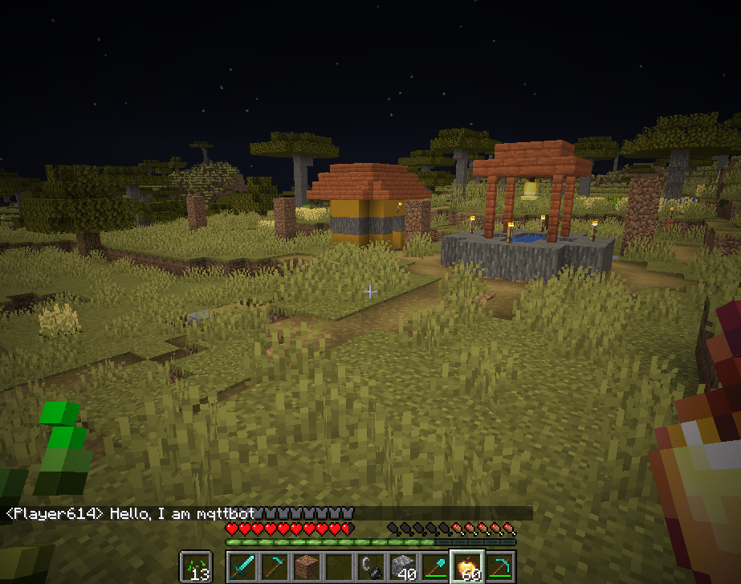

# Mqtt automaton mod

This mod was originally designed to allow automating baritone operations to reproduce transient odd behaviour when
building litematica schematics. However, it has
since been extended to support a variety of automations of other modes, based on either
API or direct command calls into them.

## Prerequisites

The automation communicates to the bot using mqtt. Therefore, you need a mqtt server
instance running that both the client and the instance can connect to. I recommend
mosquitto, because it is very simple to setup, however any mqtt server should work.

Currently the mod depends on having baritone and Wurst installed in the client.

## Getting started

Initially you want to check the mod loaded and connected to mqtt:

```
[16:55:12] [main/INFO] (FabricLoader) Loading 56 mods:
	- baritone 1.15.0
	...
	- mqttbot 1.0.1
	...
```

You should also see some logging related to mqtt connectivity:

```
[16:55:25] [Render thread/INFO] (Minecraft) [STDOUT]: Starting MqttBot Client...
[16:55:25] [Render thread/INFO] (MqttClientInternal) Initializing MqttClientInternal
[16:55:25] [Render thread/INFO] (MqttClientInternal) Initializing MQTT client
[16:55:25] [Render thread/INFO] (MqttClientInternal) MQTT ClientId: Player614
[16:55:25] [Render thread/INFO] (MqttClientInternal) Connected to MQTT broker: tcp://mosquitto.lan:1883
[16:55:25] [Render thread/INFO] (MqttClientInternal) Subscribing to MQTT topics: mqttbot/bots/command, mqttbot/Player614/command
[16:55:25] [Render thread/INFO] (MqttClientInternal) MqttClientInternal initialized successfully
```

If that is successful, you can try interacting with the bot via mqtt:

In the simple case you can send a raw json message to the "all bots" topic, which will send the included message to the chat session of the client:

```shell

mosquitto_pub \
  -h mosquitto.lan \
  -t "mqttbot/bots/command" \
  -m '{"service":"commands","method":"chatMessage","params":{"message":"Hello, I am mqttbot"}}'

```


